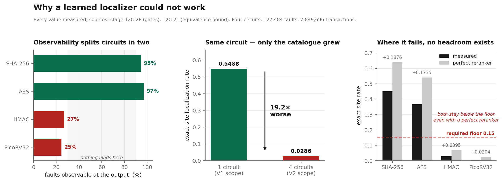

<div align="center">

# CircuitSage V2

### A machine-learning study whose main result is that the machine learning didn't work.

Six models, pre-registered. All six falsified. The thing that beat them has no parameters at all.

<p>


</p>

</div>

---

## Why this exists

I spent two days optimising the wrong metric.

The plan was ordinary: train a graph neural network to find which gate in a chip has gone
faulty, given only the circuit's observable output. I had a working detector from V1 and
four characterised circuits. Localization seemed like the natural next step.

The models trained. Training accuracy climbed. Calibration accuracy didn't move.

I assumed underfitting and tried harder negatives. Then attention. Then an ensemble. Then a
reranker that could only reorder an existing candidate list, so its worst case was tying the
baseline. That one returned a lift of **exactly 1.00×** — at every epoch, on every circuit.

An exact 1.00× isn't a bad result. It's a *suspicious* one. Models don't tie a baseline that
precisely by accident.

So I stopped training things and measured the problem instead. Every fault site carries
exactly two faults (stuck-at-0 and stuck-at-1, so inside a group of behaviourally
identical faults, the posterior over sites is 1/k no matter what the model knows. The true
site sits at depth percentile 0.4961–0.5083 against a uniform expectation of 0.5000. No
feature separates it, because no feature *can*.

The reranker wasn't failing. It was answering an unanswerable question correctly.

This repository is what that investigation left behind: the stage scripts, the contracts I
froze before measuring, and the audit trail. The negative results are the point, not an
appendix.

---

<div align="center">

</div>

---

## The three findings

**Localization accuracy was never a property of the model.**

Take the identical circuit, the identical faults, the identical method. Now grow the
candidate catalogue from one circuit to four:

| candidate catalogue | exact-site rate |
|---|---|
| 1 circuit (V1 scope) | 0.5488 |
| 4 circuits (V2 scope) | 0.0286 |

A **19.2× collapse** with one variable changed. V1's strong number wasn't skill. It was a small catalogue. That single comparison reframed the entire project.

**Observability is bimodal, not continuous.**

| circuit | class | faults observable | exact-site | MRR |
|---|---|---|---|---|
| `secworks_sha256` | crypto hash | 94.7% | 0.4516 | 0.6745 |
| `secworks_aes` | crypto block | 97.1% | 0.3675 | 0.5463 |
| `opentitan_hmac_sha256` | crypto + control | 26.8% | 0.0286 | 0.2544 |
| `picorv32_cpu` | RISC-V CPU | 24.6% | 0.0045 | 0.0989 |

Crypto datapaths push almost every fault to an output. CPU-class circuits mask three
quarters of them. Nothing sits in between, and everything else in the study follows this split.

**The remaining ambiguity is structural.**

Between **83.3% and 99.8%** of ambiguous candidate sets are structurally equivalent: the
faults inside them cannot be told apart by *any* response-based method. When this tool
returns six candidates, that's usually the real resolution limit, not a weak search.

> Behaviour-signature localization resolves faults to their **equivalence class**, the finest resolution any response-based method can achieve. The residual ambiguity is
> structural, not methodological, and matches the classical fault-collapsing result.

---

## The part I'd want a reviewer to check first

Before opening the sealed test circuit, I froze a falsifiable prediction: `secworks_chacha`
would land in **[0.20, 0.70]** exact-site and clear the 0.15 floor. The capture code was
mechanically blocked from reading that band, and the signature table was hashed before any
metric was computed.

Measured: **0.3440**. Inside the band.

That's a real prediction-before-truth result, and it's also **one circuit**. The CPU-class
circuit that would have tested the harder half of the hypothesis could not be captured at
all (see below). One confirmed prediction is evidence. It isn't generalization.

---

## Acceptance outcome: NOT MET

The pre-registered contract required the exact-site floor (≥ 0.15) on **both** independent
test circuits.

| circuit | captured | exact-site | meets floor |
|---|---|---|---|
| `secworks_chacha` | yes | 0.3440 | yes |
| `ibex_cpu` | **no** | — | — |

`ibex_cpu` couldn't be synthesised from the acquired snapshot. It references OpenTitan infrastructure (`lc_ctrl_pkg`, RAM primitive packages, `PRIM_FLOP_SPARSE_FSM`) that isn't in the ibex tree. I could have written stand-ins for those. I didn't, because then the faults
would land in logic I wrote rather than in ibex, inside a one-shot evaluation where that
contamination could never be undone.

So the outcome is **capture infeasibility, not a measured shortfall**, and independent-circuit
generalization is reported as **NOT ESTABLISHED**. The one-shot evaluation remains unspent.

<details>
<summary><b>The six falsified formulations</b></summary>

<br>

| formulation | parameters | outcome |
|---|---|---|
| `GRAPHSAGE_METRIC_SMALL` | 80,708 | no transfer to unseen circuits |
| `GATV2_CROSS_FUSION` | 182,052 | no transfer; apparent gain inside the noise band |
| `GRAPHSAGE_OOD_ENSEMBLE` | 133,702 | no transfer |
| set reranker | 40,033 | lift exactly 1.00× at every epoch |
| observability GNN | 41,649 | AUROC 0.348 — below random |
| hard-negative retraining | — | endpoint identical to random negatives |

Against the full candidate pool the trained models reached MRR 0.0027–0.0037. The
zero-parameter comparator reached **0.6745**, roughly **182× better**, with the trained
models' median rank sitting at ~3,134–4,917 out of 9,127: indistinguishable from random.

I predicted the observability GNN would work. It returned AUROC 0.348, which is worse than
guessing. That stage is frozen in the repository with the prediction intact.

</details>

<details>
<summary><b>Four defects I found in my own work</b></summary>

<br>

| defect | how it surfaced | fix |
|---|---|---|
| V1 verification was a scope gate that never called `predict_proba` | reading the source while packaging | new stage; original preserved unmodified |
| Graph features double-scaled, saturating 34% of outputs to exactly 0 or 1 | output distribution looked wrong, not an exception | convention frozen, asserted by regression test |
| Shipped dictionary stored candidate *counts*, not candidate *sites* | it could say "3 candidates" but not which 3 | 127,484 site entries exported |
| Scoring rule had no label for an uncapturable circuit | `ibex_cpu` didn't fit any existing label | added `NOT_SCORABLE`; original rule untouched |

The second one is the instructive failure. The pipeline threw no error and returned
confident verdicts the whole time. A model that runs is not a model that works.

</details>

---

## Layout

```
stages/     76 stage scripts, each independently runnable
config/     66 contracts: acceptance criteria frozen before measurement
audit/      176 freeze/manifest artifacts + 123 metric tables
corpus/     6 pinned RTL archives + acquisition registry
rtl/ tb/    21 HDL sources: wrappers and fault-injection testbenches
```

Every stage answers two flags without executing anything:

```bash
python3 stages/stage_12c2l_equivalence_bound.py --status     # read back a frozen result
python3 stages/stage_12c3b_chacha_capture.py --self-test     # validate preconditions
```

---

## How the evidence is kept honest

| control | mechanism |
|---|---|
| Append-only | no frozen stage is ever edited; corrections become new stages |
| Prediction before truth | sealed-circuit predictions frozen first; capture code blocked from reading them |
| One-shot evaluation | the locked test opens once, still unspent |
| Partition accounting | every stage records test/validation/holdout access; all are 0 |
| Toolchain pinning | Verilator `5.051 devel rev v5.050-222-gf6f6f8404 (mod)`, Yosys `0.68+106 (git sha1 c92678eb2-dirty)`; re-simulation reproduces frozen batches byte-identically |
| Sealed holdout | `serv_cpu` stays sealed and is **not redistributed here**, so the seal remains checkable |

---

## Reproducibility, honestly

**You can inspect** every stage's logic, every pre-registered contract, every metric table,
and the internal consistency of the audit chain. All 519 files ship with recorded hashes.

**You cannot re-verify offline.** The raw simulation data is 3.7 GB across 4,827 batch
files and isn't redistributed at that size. Many audit hashes reference those inputs, so
independent verification means rerunning the campaigns with the pinned toolchain: hours to days of CPU time.

**One thing can't be reproduced at all:** `ibex_cpu` cannot be characterised from the pinned
snapshot by anyone, including me. That's a property of the upstream source.

Calling this "fully reproducible" would undercut the rigour it's meant to document. It is
inspectable and rerunnable, not re-verifiable on a laptop.

---

## Related repositories

| | what it is |
|---|---|
| [**V1**](https://github.com/pavannithin224-abcd/circuitsage-hmac-fault-detection) | HMAC fault detection (a trained classifier, 93,185 parameters) |
| **V2** *(here)* | the generalization study: method, contracts, audit trail, negative results |
| **Faultiva** | the shipping hybrid detector and localizer, *released separately* |

Faultiva's model card cites audit hashes from this repository. Making those citations
checkable is what this repository is for.

---

## Citation

```bibtex
@software{circuitsage_v2_2026,
  title   = {CircuitSage V2: Behaviour-Signature Fault Localization is Bounded
             by Structural Fault Equivalence},
  author  = {Nithin, Pavan},
  year    = {2026},
  version = {2.2.0},
  url     = {https://github.com/pavannithin224-abcd/circuitsage-vlsi-fault-detection-v2}
}
```

See [`CITATION.cff`](CITATION.cff). GitHub renders this from the **Cite this repository** button.

## License

Apache-2.0, matching V1 and carrying its explicit patent grant. See [`LICENSE`](LICENSE).

Third-party RTL under `corpus/` keeps its **original upstream licensing** (Apache-2.0, ISC,
BSD-2-Clause). [`THIRD_PARTY_NOTICE.md`](THIRD_PARTY_NOTICE.md) has per-project attribution
and pinned revisions. Apache-2.0 covers only what I wrote.

---

<div align="center">
<sub>Built as an undergraduate major project. The negative results are published because the bound is the finding.</sub>
</div>
